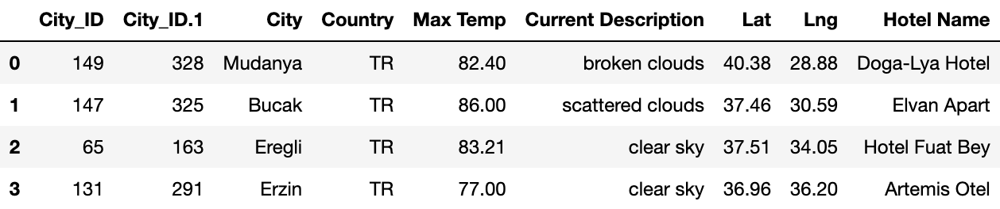
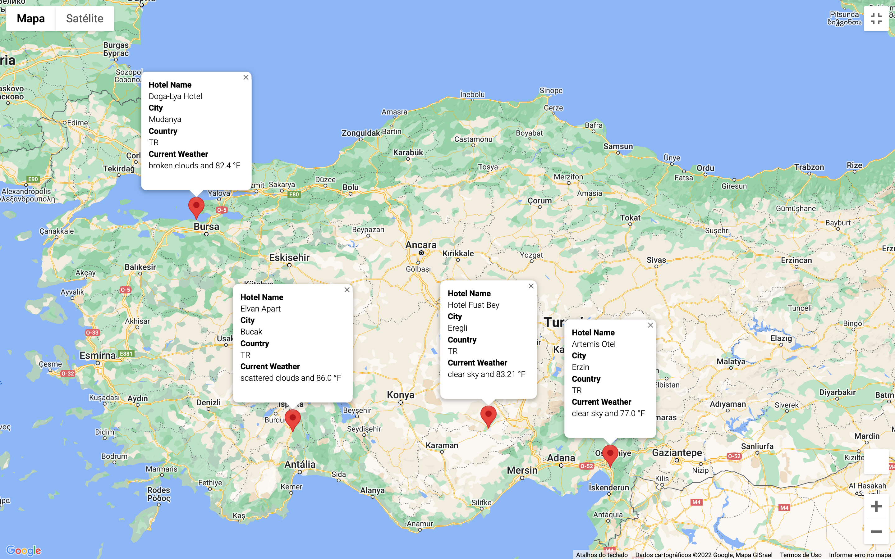

# World_Weather_Analysis_2
## Overview
The purpose of this project it is to analyze weather data for a hypothetical travel company. The main is to collect and present data for customers via a search page, which they will filter based on their preferred travel criterias in order to find their ideal destine and hotel anywhere the world.

## Resources 
- Data Source: weatherpy_vacation.csv, weatherpy_vacation_backup.csv, weatherpy_database.csv, 
- Software: Pandas, Jupyter Notebook 6.4.8, Google API, WeatherMap API

## Results 
An itinerary was created for the customer, first filtering by temperature in Fahrenheit, finding destinations worldwide and then filtering by the country they wanted to visit, Turkey. In the itinerary, it is possible to visualize the cities that will pass and which hotels will stay at, bringing ease and practicality to your trip.

.
.
